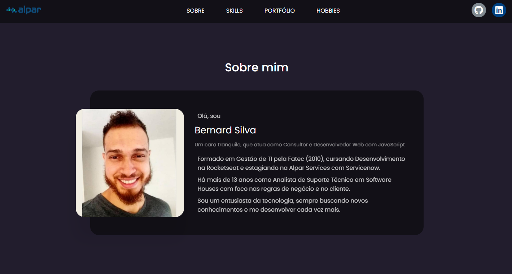
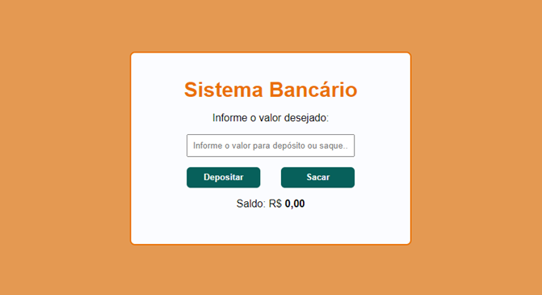
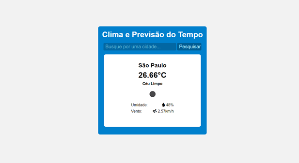
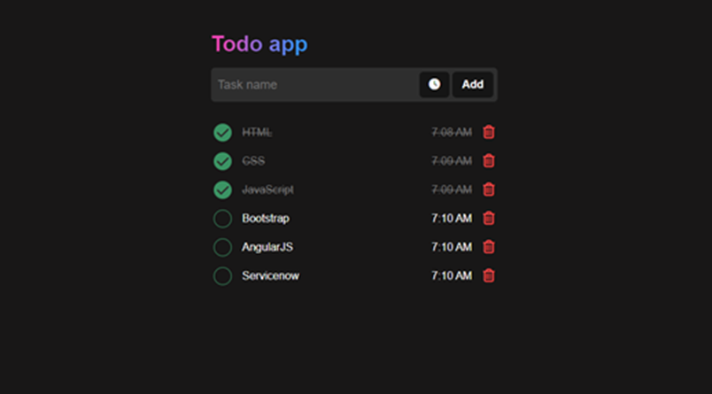
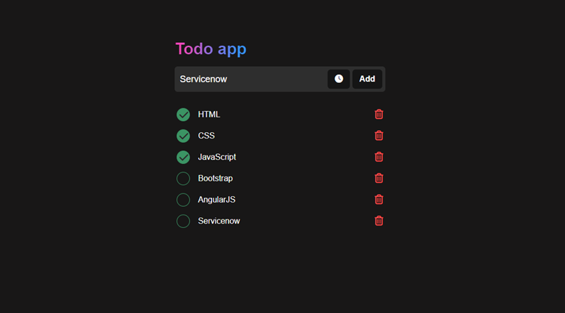
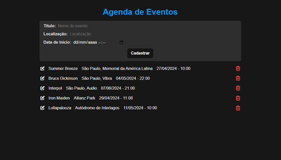

# <center>Portfólio - Alpar Rocket Program</center>

<p align="center">
   
</p>

<div align="center">

  **Deployed URL**
  </br>
  https://bernard-silva.github.io/repositorio-alpar/
  </br>

  [Português](#pt) / [English](#en)

</div>


## 📝 Índice <a name = "pt"></a>

- [Atividade 1 - Portfólio](#activ1_pt)
- [Atividade 2 - Cardápio de uma Cafeteria](#activ2_pt)
- [Atividade 3 - Tela de Login da Cafeteria](#activ3_pt)
- [Atividade 4 - podHIMYM](#activ4_pt)
- [Atividade 5 - Pokédex](#activ5_pt)
- [Atividade 6 - Sistema Bancário](#activ6_pt)
- [Atividade 7 - Controle de Iluminação](#activ7_pt)
- [Atividade 8 - Clima e Previsão do Tempo](#activ8_pt)
- [Atividade 9 - Todo App (Frontend)](#activ9_pt)
- [Atividade 10 - Todo App (Frontend/Backend)](#activ10_pt)
- [Atividade 11 - Agenda de Eventos (Frontend/Backend)](#activ11_pt)
- [Atividade 12 - Ecommerce Berns Store (Frontend/Backend)](#activ12_pt)
- [Como utilizar](#running_pt)


## 🎯 Atividade 1 - Portfólio <a name = "activ1_pt"></a>

  

- Portfólio contendo breve apresentação, skills, atividades desenvolvidas no decorrer do curso e alguns dos meus hobbies.
- Linguagens e Tecnologias: **HTML/CSS/JS (Frontend)**
- Deploy: https://bernard-silva.github.io/repositorio-alpar/
- GitHub: https://github.com/bernard-silva/repositorio-alpar/

## 🎯 Atividade 2 - Cardápio de uma Cafeteria <a name = "activ2_pt"></a>

  

- Cardápio de uma Cafeteria utilizando listas ordenadas, não ordenadas e tabelas.
- Linguagens e Tecnologias: **HTML/CSS/JS (Frontend)**
- Deploy: https://bernard-silva.github.io/repositorio-alpar/atividade2/atividade2_v2/
- GitHub: https://github.com/bernard-silva/repositorio-alpar/tree/main/atividade2/atividade2_v2

## 🎯 Atividade 3 - Tela de Login da Cafeteria <a name = "activ3_pt"></a>

  

- Tela de Login da Cafeteria utilizando formulário com required (sem autenticação) direcionando para a atividade 2 do Cardápio.
- Linguagens e Tecnologias: **HTML/CSS (Frontend)**
- Deploy: https://bernard-silva.github.io/repositorio-alpar/atividade3/
- GitHub: https://github.com/bernard-silva/repositorio-alpar/tree/main/atividade3/

## 🎯 Atividade 4 - podHIMYM <a name = "activ4_pt"></a>

  

- Podcast sobre a série de sitcom How I Met Your Mother, onde utilizando as tags de video e audio é feita uma apresentação e um podcast relacionado a tecnologia. `Observação`: botões do player do rodapé ainda não funcionais.
- Linguagens e Tecnologias: **JS Funcional (Frontend)**
- Deploy: https://bernard-silva.github.io/repositorio-alpar/atividade4/
- GitHub: https://github.com/bernard-silva/repositorio-alpar/tree/main/atividade4/

## 🎯 Atividade 5 - Pokédex <a name = "activ5_pt"></a>

  

- Consumido a [**PokéAPI**](https://pokeapi.co/) para criar uma Pokédex que carrega até 20 pokémons, onde foi utilizado o evento de scroll (eixo Y) com uma lógica para chamar a API e carregar mais 20 pokémons quando atingido 80% de rolagem do scroll.
- Linguagens e Tecnologias: **JS com Fetch API (Frontend)**
- Deploy: https://bernard-silva.github.io/repositorio-alpar/atividade5/
- GitHub: https://github.com/bernard-silva/repositorio-alpar/tree/main/atividade5/

## 🎯 Atividade 6 - Sistema Bancário <a name = "activ6_pt"></a>

  

- Utilizado o paradigma POO para instanciar uma única conta bancária e utilizar seus métodos de getters e setters para realizar transações de saque e depósito.
- Linguagens e Tecnologias: **JS com POO (Frontend)**
- Deploy: https://bernard-silva.github.io/repositorio-alpar/atividade6/
- GitHub: https://github.com/bernard-silva/repositorio-alpar/tree/main/atividade6/

## 🎯 Atividade 7 - Controle de Iluminação <a name = "activ7_pt"></a>

  

- Controle de Luzes de uma casa utilizando Observers (Pub/Sub) onde realizei a inscrição de cada cômodo instanciando a partir de Singleton.
- Linguagens e Tecnologias: **JS/POO/Singleton/Observers (Frontend)** 
- Deploy: https://bernard-silva.github.io/repositorio-alpar/atividade7/
- GitHub: https://github.com/bernard-silva/repositorio-alpar/tree/main/atividade7/

## 🎯 Atividade 8 - Clima e Previsão do Tempo <a name = "activ8_pt"></a>

  

- Projeto de consulta de Previsão do Tempo por nome de qualquer cidade, onde a proposta é consumir a API [**OpenWeather**](https://openweathermap.org/) utilizando POO e MVC no frontend separando os códigos por responsabilidades.
- Linguagens e Tecnologias: **JS/POO/API/MVC (Frontend)**
- Deploy: https://bernard-silva.github.io/repositorio-alpar/atividade8/
- GitHub: https://github.com/bernard-silva/repositorio-alpar/tree/main/atividade8/

## 🎯 Atividade 9 - Todo App (Frontend) <a name = "activ9_pt"></a>

  

- Clonado o design [**Todo app UI design**](https://dribbble.com/shots/17090922-Todo-app-UI-design) do dribbble e aplicado Javascript Funcional utilizando localStorage para Salvar as tarefas no frontend. `Observação`: botão de data/hora apenas ilustrativo, não está funcional.
- Linguagens e Tecnologias: **JS/localStorage (Frontend)**
- Deploy: https://bernard-silva.github.io/repositorio-alpar/atividade9/
- GitHub: https://github.com/bernard-silva/repositorio-alpar/tree/main/atividade9/

## 🎯 Atividade 10 - Todo App (Frontend/Backend) <a name = "activ10_pt"></a>

  

- Idem Atividade 9, porém desenvolvido API backend com Node.js/Express e base de dados com o ORM Prisma. Utilizado o recurso Static Public do Express para desenvolvimento do frontend e body-parser como middleware nas chamadas à API.
- Linguagens e Tecnologias: **JS/Node.js/Express/Prisma/SQLite (Frontend/Backend)**
- GitHub: https://github.com/bernard-silva/backend-todo-mine

## 🎯 Atividade 11 - Agenda de Eventos <a name = "activ11_pt"></a>

  

- Cadastro de Agenda de Eventos permitindo edição e exclusão utilizando AngularJS no frontend e Node.js/Express no backend com ORM Prisma.
- Linguagens e Tecnologias: **AngularJS/Node.js/Express/Prisma/SQLite (Frontend/Backend)**
- GitHub: https://github.com/bernard-silva/backend-agenda-eventos

## 🎯 Atividade 12 - Ecommerce Berns Store  <a name = "activ12_pt"></a>

  

- Ecommerce Berns Store de Tecnologia onde é possível se cadastrar, logar, adicionar produtos ao carrinho, finalizar compras, visualizar as compras realizadas. Em perfil de admin é possível listar todos os produtos, editar e adicionar novos produtos, onde ao clicar no logotipo sempre direciona para a home.
- Linguagens e Tecnologias: **AngularJS/Bootstrap/Node.js/Express/Prisma/SQLite (Frontend/Backend)**
- GitHub: https://github.com/bernard-silva/ecommerce-berns-store-node-angularjs

## 🖥️ Como utilizar <a name = "running_pt"></a>

Clone o projeto:

```
git clone https://github.com/bernard-silva/repositorio-alpar.git
```

</br>

## English

## 📝 Index <a name = "en"></a>

- [Activity 1 - Portfolio](#activ1_en)
- [Activity 2 - Cafeteria menu](#activ2_en)
- [Activity 3 - Cafeteria Login Screen](#activ3_en)
- [Activity 4 - podHIMYM](#activ4_en)
- [Activity 5 - Pokédex](#activ5_en)
- [Activity 6 - Banking System](#activ6_en)
- [Activity 7 - Lighting Control](#activ7_en)
- [Activity 8 - Climate and Weather Forecast](#activ8_en)
- [Activity 9 - Todo App (Frontend)](#activ9_en)
- [Activity 10 - Todo App (Frontend/Backend)](#activ10_en)
- [Activity 11 - Events Calendar (Frontend/Backend)](#activ11_en)
- [Activity 12 - Ecommerce Berns Store (Frontend/Backend)](#activ12_en)
- [How to use](#running_en)


## 🎯 Activity 1 - Portfolio <a name = "activ1_en"></a>

  

- Portfolio containing a brief presentation, skills, activities developed during the course and some of my hobbies.
- Languages ​​and Technologies: **HTML/CSS/JS (Frontend)**
- Deploy: https://bernard-silva.github.io/repositorio-alpar/
- GitHub: https://github.com/bernard-silva/repositorio-alpar/

## 🎯 Activity 2 - Cafeteria menu <a name = "activ2_en"></a>

  

- Menu of a Cafeteria using ordered, unordered lists and tables.
- Languages ​​and Technologies: **HTML/CSS/JS (Frontend)**
- Deploy: https://bernard-silva.github.io/repositorio-alpar/atividade2/atividade2_v2/
- GitHub: https://github.com/bernard-silva/repositorio-alpar/tree/main/atividade2/atividade2_v2

## 🎯 Activity 3 - Cafeteria Login Screen <a name = "activ3_en"></a>

  

- Cafeteria Login Screen using a required form (without authentication) directing to activity 2 of the Menu.
- Languages ​​and Technologies: **HTML/CSS (Frontend)**
- Deploy: https://bernard-silva.github.io/repositorio-alpar/atividade3/
- GitHub: https://github.com/bernard-silva/repositorio-alpar/tree/main/atividade3/

## 🎯 Activity 4 - podHIMYM <a name = "activ4_en"></a>

  

- Podcast about the sitcom series How I Met Your Mother, using the video tag for a presention and audio tag for a podcast related to technology. `Note`: Footer player buttons not yet functional.
- Languages ​​and Technologies: **Functional JS (Frontend)**
- Deploy: https://bernard-silva.github.io/repositorio-alpar/atividade4/
- GitHub: https://github.com/bernard-silva/repositorio-alpar/tree/main/atividade4/

## 🎯 Activity 5 - Pokédex <a name = "activ5_en"></a>

  

- Consumed the [**PokéAPI**](https://pokeapi.co/) to create a Pokédex that loads up to 20 Pokémon, where the scroll event (Y axis) was used with logic to call the API and load 20 more Pokémon when the scroll reaches 80%.
- Languages ​​and Technologies: **JS with Fetch API (Frontend)**
- Deploy: https://bernard-silva.github.io/repositorio-alpar/atividade5/
- GitHub: https://github.com/bernard-silva/repositorio-alpar/tree/main/atividade5/

## 🎯 Activity 6 - Banking System <a name = "activ6_en"></a>

  

- Used the OOP paradigm to instantiate a single bank account and use its getters and setters methods to carry out withdrawal and deposit transactions.
- Languages ​​and Technologies: **JS with OOP (Frontend)**
- Deploy: https://bernard-silva.github.io/repositorio-alpar/atividade6/
- GitHub: https://github.com/bernard-silva/repositorio-alpar/tree/main/atividade6/

## 🎯 Activity 7 - Lighting Control <a name = "activ7_en"></a>

  

- Control of lights in a house using Observers (Pub/Sub) where I registered each room by instantiating it from Singleton.
- Languages ​​and Technologies: **JS/POO/Singleton/Observers (Frontend)**
- Deploy: https://bernard-silva.github.io/repositorio-alpar/atividade7/
- GitHub: https://github.com/bernard-silva/repositorio-alpar/tree/main/atividade7/

## 🎯 Activity 8 - Climate and Weather Forecast <a name = "activ8_en"></a>

  

- Weather Forecast query project by name of any city, where the proposal is to consume the API [**OpenWeather**](https://openweathermap.org/) using OOP and MVC in the frontend, separating the codes by responsibilities.
- Languages ​​and Technologies: **JS/POO/API/MVC (Frontend)**
- Deploy: https://bernard-silva.github.io/repositorio-alpar/atividade8/
- GitHub: https://github.com/bernard-silva/repositorio-alpar/tree/main/atividade8/

## 🎯 Activity 9 - Todo App (Frontend) <a name = "activ9_en"></a>

  

- Cloned the design [**Todo app UI design**](https://dribbble.com/shots/17090922-Todo-app-UI-design) from dribbble and applied Functional Javascript using localStorage to save tasks in the frontend. `Note`: date/time button for illustration purposes only, not functional.
- Languages ​​and Technologies: **JS/localStorage (Frontend)**
- Deploy: https://bernard-silva.github.io/repositorio-alpar/atividade9/
- GitHub: https://github.com/bernard-silva/repositorio-alpar/tree/main/atividade9/

## 🎯 Activity 10 - Todo App (Frontend/Backend) <a name = "activ10_en"></a>

  

- Same Activity 9, but developed backend API with Node.js/Express and database with ORM Prisma. Used Express's Static Public feature for frontend development and body-parser as middleware in API calls.
- Languages ​​and Technologies: **JS/Node.js/Express/Prisma/SQLite (Frontend/Backend)**
- GitHub: https://github.com/bernard-silva/backend-todo-mine

## 🎯 Activity 11 - Events Calendar <a name = "activ11_en"></a>

  

- Registration of Event Calendar allowing editing and deletion using AngularJS on the frontend and Node.js/Express on the backend with ORM Prisma.
- Languages ​​and Technologies: **AngularJS/Node.js/Express/Prisma/SQLite (Frontend/Backend)**
- GitHub: https://github.com/bernard-silva/backend-agenda-eventos

## 🎯 Activity 12 - Ecommerce Berns Store <a name = "activ12_en"></a>

   

- Ecommerce Berns Technology Store where it is possible to register, log in, add products to the cart, complete purchases, view purchases made. In the admin profile you can list all products, edit and add new products, where clicking on the logo always takes you to the home page.
- Languages and Technologies: **AngularJS/Bootstrap/Node.js/Express/Prisma/SQLite (Frontend/Backend)**
- GitHub: https://github.com/bernard-silva/ecommerce-berns-store-node-angularjs

## 🖥️ How to use <a name = "running_en"></a>

Clone the project:

```
git clone https://github.com/bernard-silva/repositorio-alpar.git
```